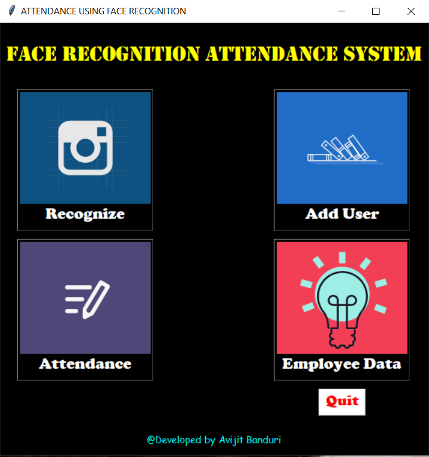
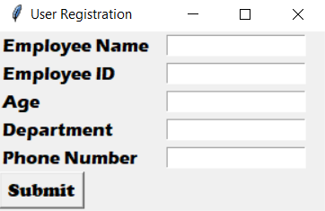
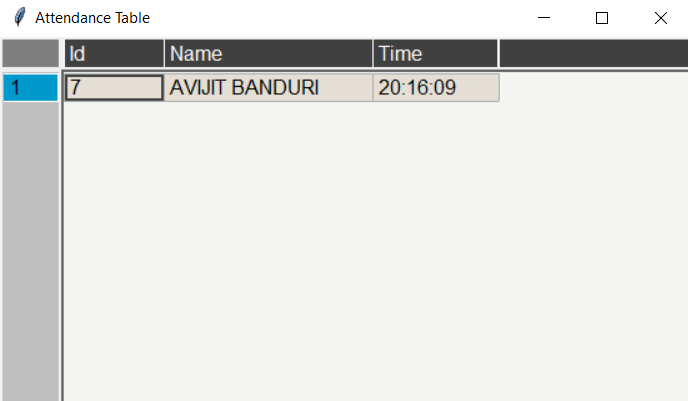
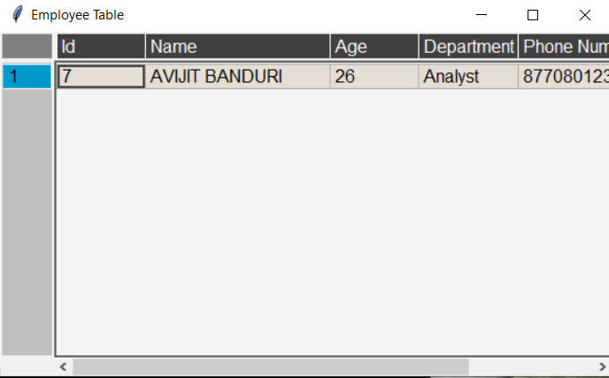

# Facial_Recognition_Attendance_System

Face Recognition Based Attendance System is The New Thing. This facial recognition attendance is made on tkinter and the model is trained on LBPHFaceRecognizer of opencv. 

All the features of the project are as follows:

1. **Add users:**
   Click on the add user button. A user registration window will pop up and you need to fill the details. The user id must be unique otherwise it generate an error. After you        click on submit, a window will pop up and take 150 pics of the user for training the model. After all the pics have been captured a message will be shown that the user has        registered successfully and it will automatically train the model. At the end, a message will be shown stating that the model is ready for reecognition.

   

2. **Recognize:**
   Click on the recognize button for attendance. It will recognize the user and display their. If their attendance is done, it will display attendance done.
   
   
   
3. **Attendance Table:**
   To check the attendance of today. Click on the attendance button. It will display User id, Name and Time at which the user was first recognized.
   
   
   
4. **Employee Table:**
   To check the employee table, click on employee button. It will display all the registered users with their details.
   
   
   
